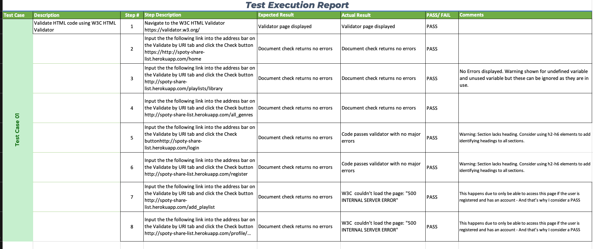
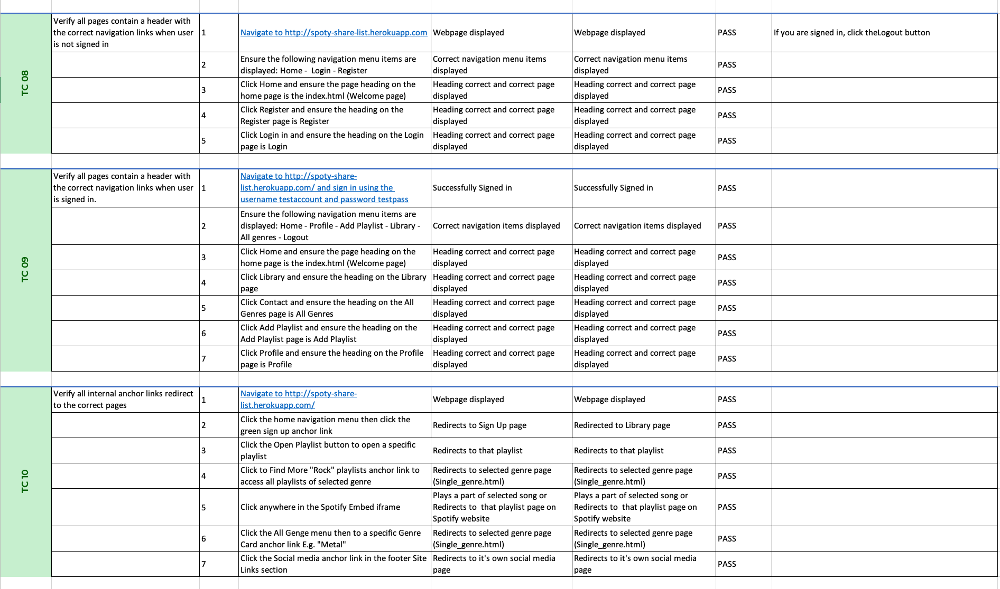
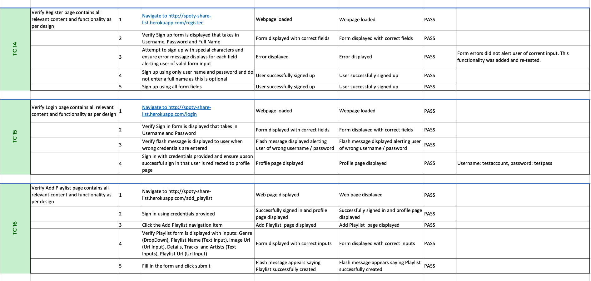
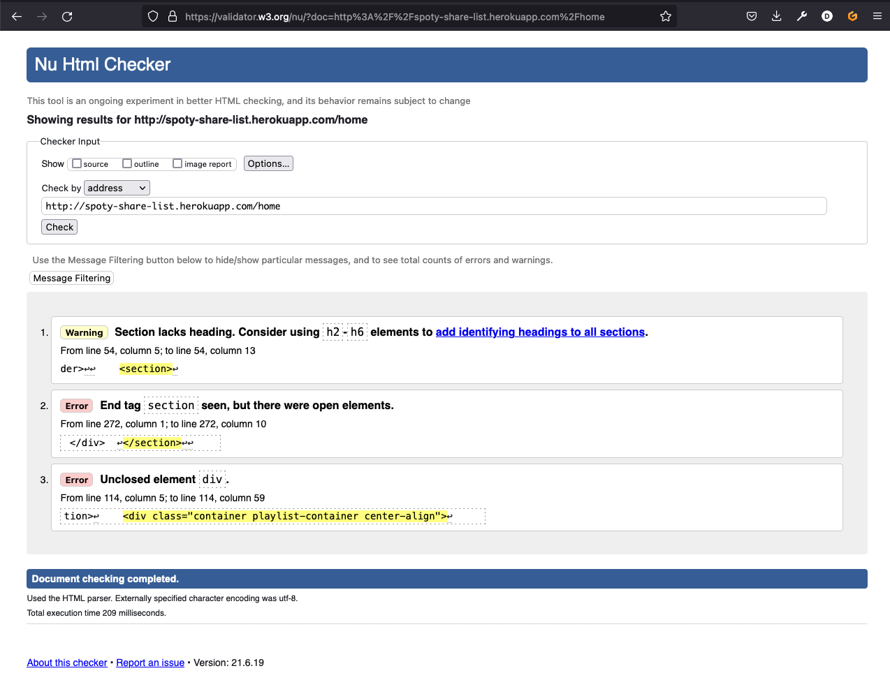
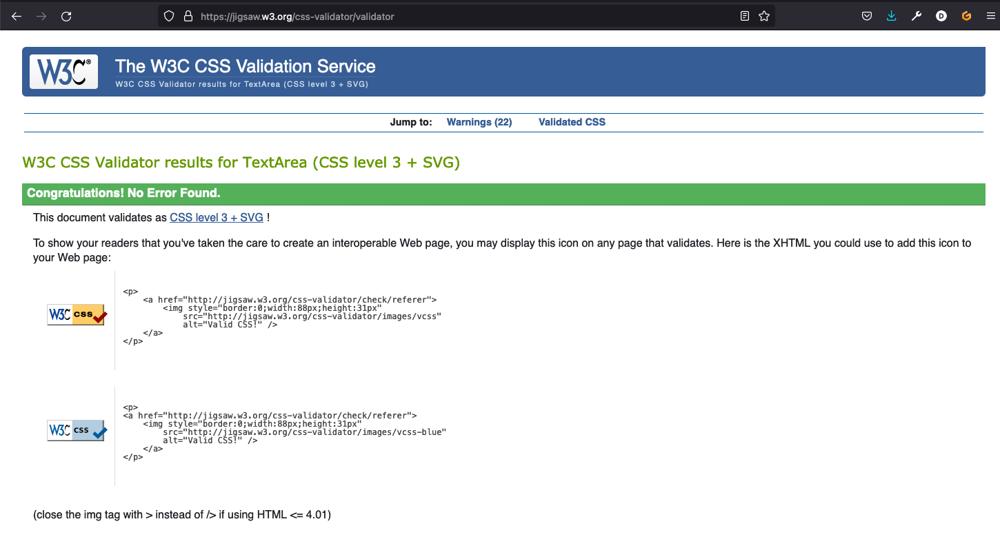
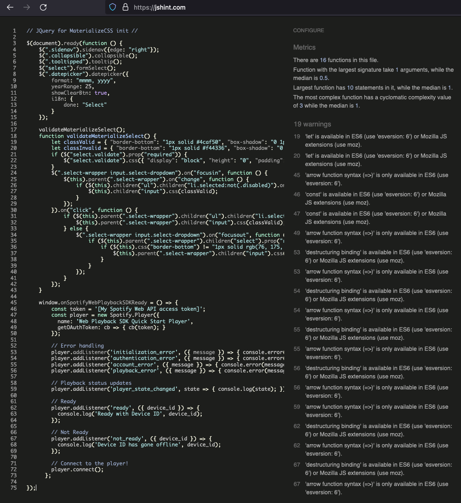
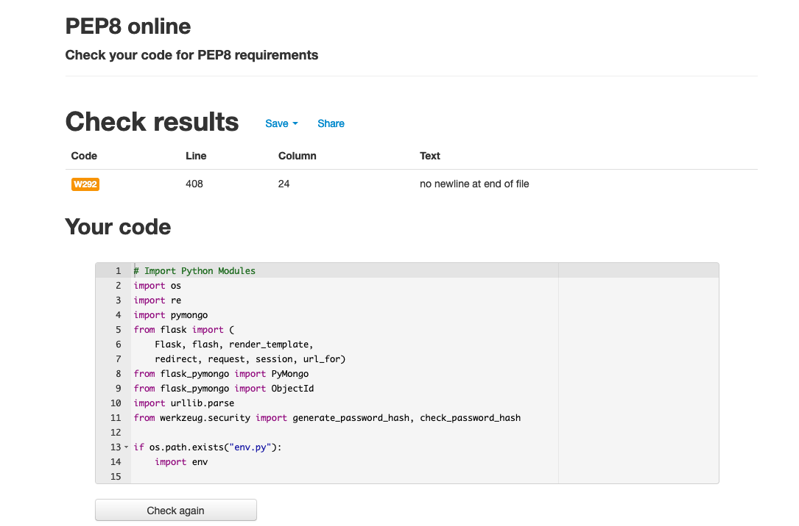
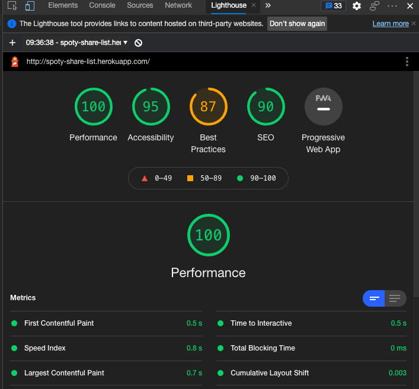

# Testing

Following the completion of the fundamental HTML code across all HTML files in the project, a code
validation test is performed using the W3C Markup Validation Service, which is a validator provided
by the World Wide Web Consortium for checking HTML and XHTML files for well-designed markup,
scanning any warnings and errors. Because the Flask Jinja template is applied in all HTML files, the
source code for testing is retrieved from the displayed pages.

Full test results can be found in an excel document [here](testing/test_results.xlsx)

## User Story Testing

### User Story:
> As a user, I want the main purpose of the site to be clear so that I immediately know what the site is intended for upon entering.

Tests Covering story:
* TC 12

### User Story:
> As a user, I want to easily navigate the site so that I can find content quickly with ease.

Tests Covering story:
* TC 08
* TC 09
* TC 10

### User Story:
> As a user, I want the website to be responsive so that I can clearly view the webpages from my mobile, tablet or desktop.

Tests Covering story:
* TC 05
* TC 06
* TC 07

### User Story:
> As a user, I want to be able to register to the website so that I can create and manage my own playlists.

Tests Covering story:
* TC 14
* TC 15
* TC 16
* TC 17
* TC 18

### User Story:
> As a user, I want to be able to search or filter playlists based on custom criteria so that I can find it.

Tests Covering story:
* TC 13

### User Story:
> As a user, I want a way to contact the site owner so that I can have any questions I may have in regards to the website answered.

Tests Covering story:
* TC 11

### User Story:
> As a user, I want to be able to return to the main site without having to use the browser buttons so that I can easily return to the website if I navigate to a page that doesn't exist.

Tests Covering story:
* TC 21

# Issues and Resolutions to issues found during testing of deployed website

Issue #1: 
> TC 01 - Step 2: Failed deployment on heroku. Wrong input on vars, caused error on Heroku app.

Issue #2: 
> TC 01 - Step 2: Failed deployment on heroku. Forgot to create a query for search on MongoDB.

Issue #3: 
> TC 01 - Step 3: Failed validation End tag main, div, open element.

Issue #4: 
> TC 04 - E501: Line too long. Fix breaking in the opening/ending parenthesis.

## Validator Results

#### HTML Results:
 

#### CSS Results:
 

#### JavaScript Results:
 

#### Python Results:
 

#### Lighthout Results:
 
